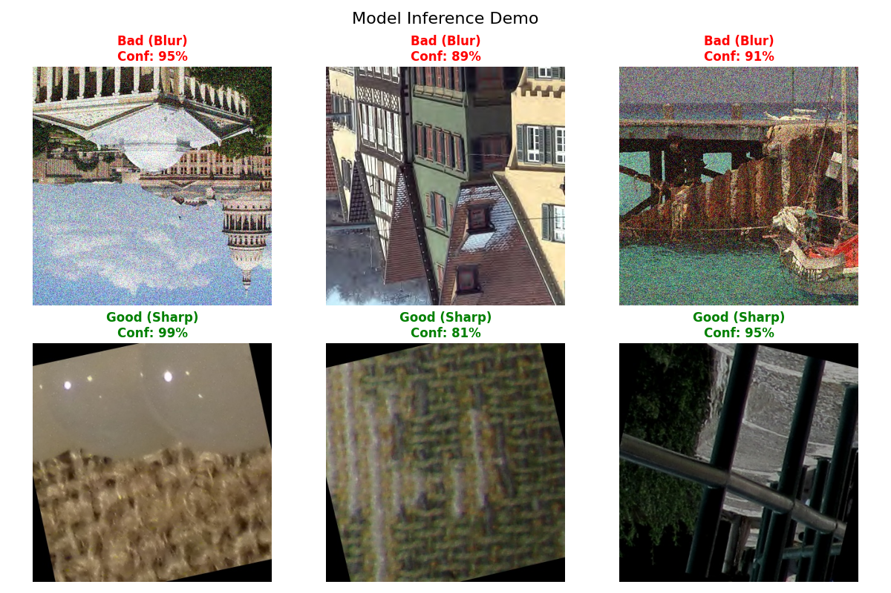

# Immich Blur Detector (EdgeTPU)


[](https://huggingface.co/spaces/majwolweg/Immich-blur-detector/)
[](https://www.python.org/downloads/release/python-3913/)
[](https://www.coral.ai/)

So this is a little project I tried to make to automatically tag blurry or bad quality photos in my Immich server. It uses a Google Coral EdgeTPU because I wanted it to be fast and run locally.

**STATUS: ABANDONED / HALTED**  
Honestly, it didn't work as well as I hoped. It flags a lot of good photos as "bad" because quality is super subjective and some noise or background blur can be just an artistic choise, and cramming that understanding into a tiny EdgeTPU model is really hard. I'm leaving the code here if anyone wants to mess with it or learn from my mistakes, but I wouldn't recommend running this on your main library without backups or verifying the tags manually.

## What you need
*   Immich server (obviously)
*   Google Coral USB Accelerator (optional, but that's what I built it for. It might run on CPU but it'll be slow)
*   Python 3.9 (pycoral is picky about versions)

## Installation
You'll need Python installed (I used 3.9).

1.  **Create a virtual environment** (recommended so you don't break your system python):
    ```bash
    py -3.9 -m venv .venv
    # Windows:
    .\.venv\Scripts\Activate.ps1
    # Linux/Mac:
    source .venv/bin/activate
    ```

2.  **Install the dependencies**:
    ```bash
    pip install -r requirements.txt
    ```
    *Note: If `pycoral` gives you a headache on Windows, check their docs or just run it in Docker/WSL.*

## Getting the Data
I wrote a little script to download the datasets (CERTH, LIVE) for you, so you don't have to hunt for links.
```bash
python setup.py
```

This extracts everything into `dataset/`.
> #### IMPORTANT
> You must manually download the **LIVE** dataset from [here](https://live.ece.utexas.edu/research/Quality/subjective.htm). Please note that you will also need to obtain the ZIP password from the authors.

## Runtime Config
Make a `.env` file in the root folder with your details:
```ini
IMMICH_URL=http://your-immich-ip:2283
IMMICH_API_KEY=your_api_key_here
BLUR_THRESHOLD=0.5
```

## How to run the tagger
To run the tagger on your library using the pre-compiled model:
```bash
python scripts/immich_blur_tagger.py
```
It will start scanning your assets, download a temporary copy, run it through the model, and tag it `blur:bad` (or `blur:good` if you change the settings) based on the score.

Use `--help` to see other options, like dry-runs (highly recommended first time!).

## Training your own model
If you think you can do better (you probably can), here's how I trained it:

1.  **Prepare the data:**
    ```bash
    python scripts/data_preprocessing/prepare_data_384.py
    ```
    This resizes images and organizes them into `prepared/`.

2.  **Train the model:**
    ```bash
    python scripts/train/train_edge_tpu_384.py
    ```
    This will spin for a while and spit out a `quality_model_max_int8.tflite` in `models/`.

3.  **IMPORTANT: Compile for Edge TPU**
    The training script just gives you a standard TFLite file. The Coral stick needs a special compiled version.
    You need the `edgetpu_compiler` (which usually runs on Linux, but you can use it on windows by using wsl).
    ```bash
    edgetpu_compiler -o models/data_formatted_native_384/ models/data_formatted_native_384/quality_model_max_int8.tflite
    ```
    This gives you `quality_model_max_int8_edgetpu.tflite`. **This** is the file the validaton and tagger scripts look for. If you don't do this, it'll try to run on CPU and be super slow.

## Credits
Based on a lot of googling and help from AI tools and a lot frustration. Enjoy!